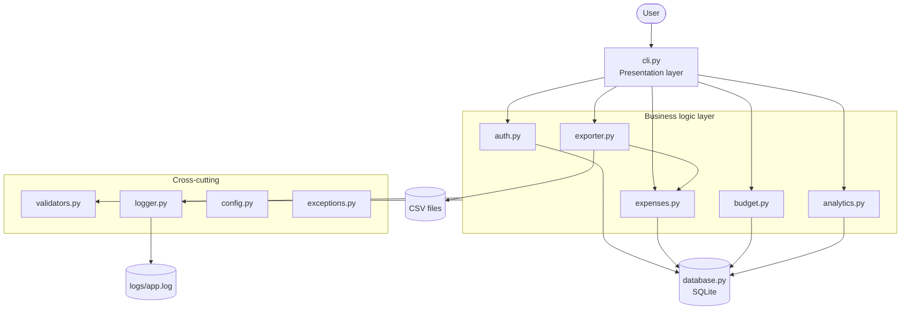
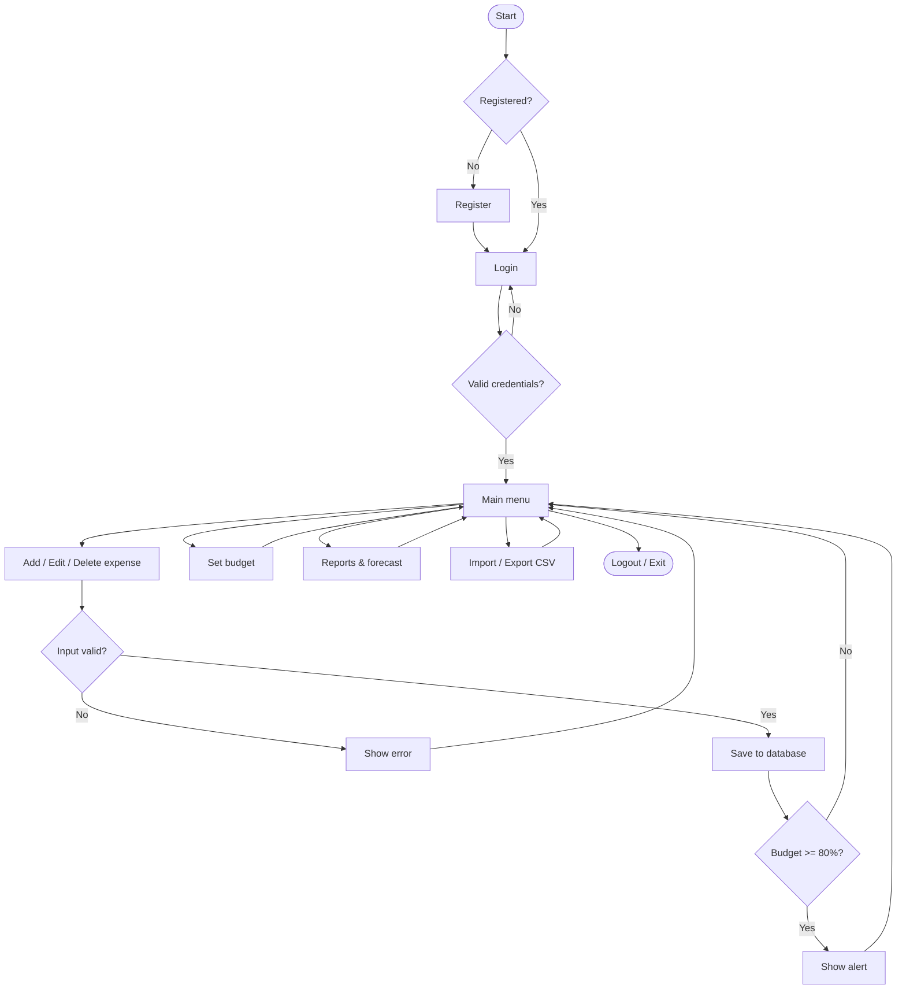
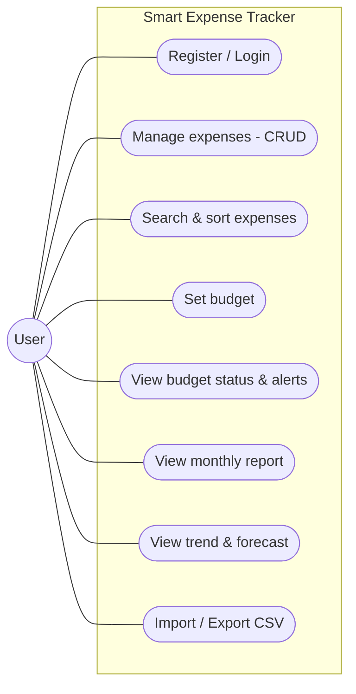
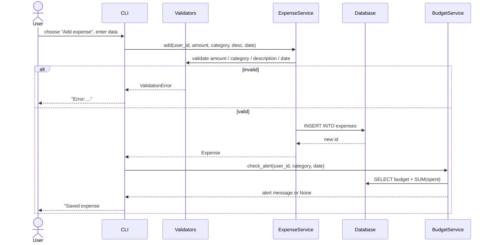
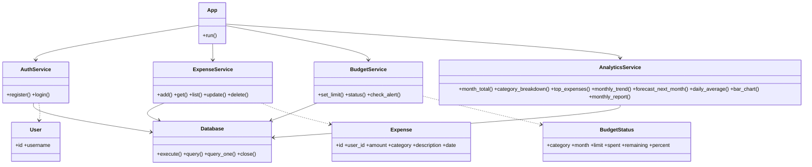
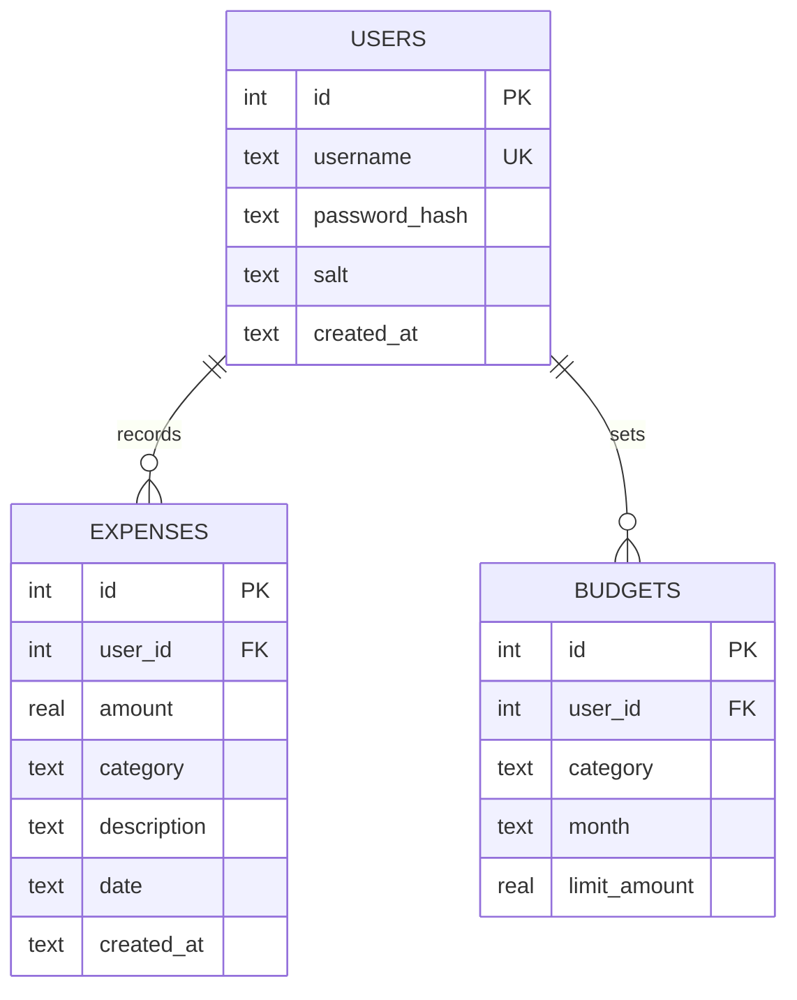

# Design Documentation

GitHub renders the Mermaid diagrams below automatically. To put them in your PDF report, open this file on
GitHub (or paste each block into <https://mermaid.live>) and export as PNG/SVG.

## 1. Problem statement & objectives
See `statement.md`. **Objectives:** (1) capture expenses quickly and safely, (2) prevent budget overruns,
(3) give insight through analytics and a forecast, (4) keep the code modular, tested and documented.

## 2. Functional requirements
| ID | Requirement |
|----|-------------|
| FR1 | User can register and log in; each user sees only their own data |
| FR2 | User can add, view, edit and delete expenses |
| FR3 | User can filter by category/month, search by keyword and sort |
| FR4 | User can set a monthly budget per category and see used/remaining amounts |
| FR5 | System warns at ≥80 % and alerts at ≥100 % of a budget when an expense is added |
| FR6 | System produces a monthly report, 6-month trend and next-month forecast |
| FR7 | User can export expenses to CSV and import from CSV |

## 3. Non-functional requirements
| ID | Category | Requirement | How it is met |
|----|----------|-------------|---------------|
| NFR1 | Security | Passwords never stored in plain text; no SQL injection | PBKDF2-SHA256 + random salt, `hmac.compare_digest`, parameterised queries, whitelist for sort/update fields |
| NFR2 | Reliability | Bad input or bad files must not crash the app | Central validators, custom exceptions, CLI catch-all, per-row CSV error reporting |
| NFR3 | Usability | Clear menus, defaults, confirmation before delete | Blank = default prompts, `YES` confirmation, readable tables |
| NFR4 | Maintainability | Small single-purpose modules, documented, tested | Layered architecture, docstrings, 31 unit tests |
| NFR5 | Logging | Important events are auditable | Rotating log file with timestamps and levels |
| NFR6 | Performance | Reports on thousands of rows respond instantly | Indexed `(user_id, date)` and SQL aggregation |
| NFR7 | Portability | Runs anywhere Python 3.9+ runs | Standard library only |

## 4. System architecture

## 5. Workflow diagram

## 6. Use case diagram

## 7. Sequence diagram - adding an expense

## 8. Class / component diagram

## 9. ER diagram & schema

Constraints: `amount > 0`, `limit_amount > 0`, `UNIQUE(user_id, category, month)`, foreign keys with `ON DELETE CASCADE`,
index on `expenses(user_id, date)`. Full DDL is in `src/expense_tracker/database.py`.

## 10. Design decisions & rationale
| Decision | Rationale |
|----------|-----------|
| Layered architecture (CLI → services → DB) | Business rules can be tested without the UI; UI can later be swapped for Tkinter/Flask |
| SQLite | Zero-setup, transactional, supports SQL aggregation for reports |
| Standard library only | Easy to run/grade, no dependency issues |
| Service classes receive `Database` (dependency injection) | Tests use `:memory:` database |
| Custom exception hierarchy | UI catches one base class and shows friendly messages |
| Amounts rounded to 2 decimals in validators | Prevents floating-point clutter in reports |
| Moving-average forecast | Simple, explainable, good enough for small personal datasets |
| Same error for unknown user and wrong password | Prevents username enumeration |

## 11. Algorithms / concepts used
Hashing with salt (PBKDF2), SQL aggregation & grouping, sorting with whitelisted keys, moving average,
month arithmetic across year boundaries, normalisation of percentages, exception handling, file I/O (CSV),
OOP (classes, dataclasses, composition), modules/packages, logging and unit testing.
